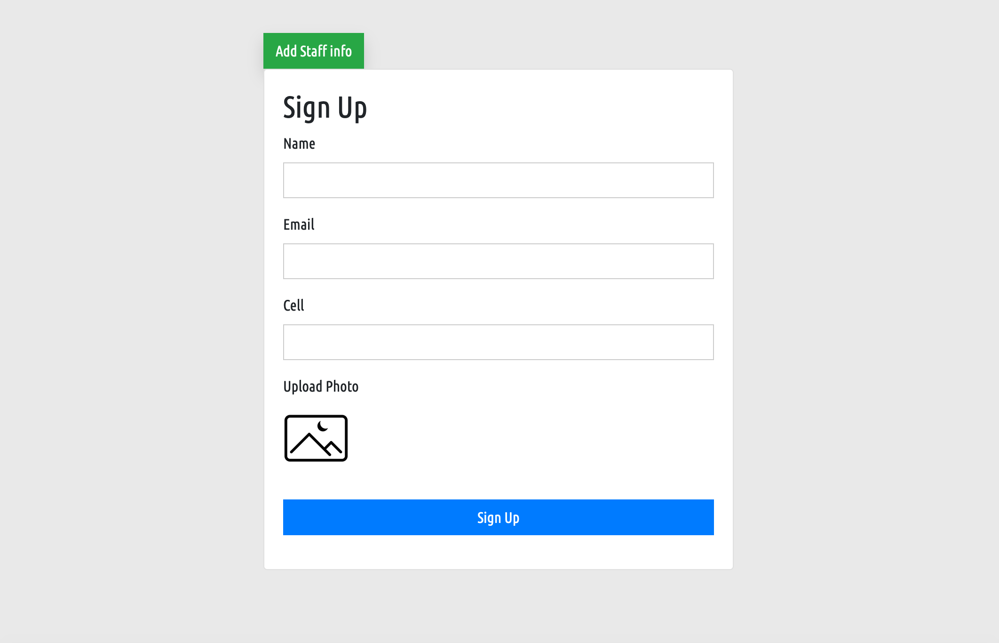
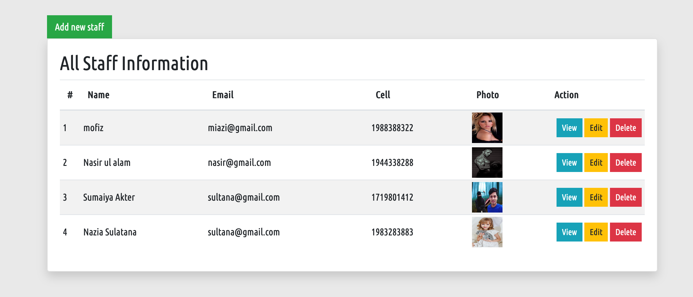
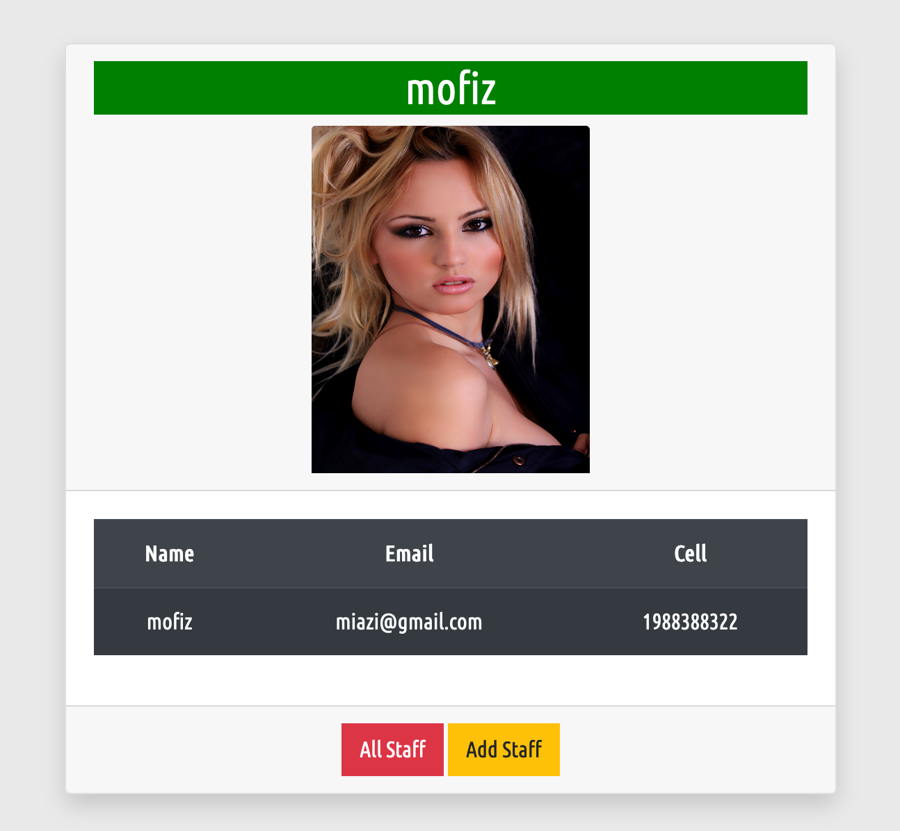

# Staff Crud Application system by OOP (PHP)



## Freatures
=============
- Staff add to database
- Staff all data show
- Staff data edit
- Staff data Delete
- Staff data Update

## Database class Design
============================

```php
namespace App\Support;

use mysqli;

/**
 * Database class
 */

abstract class Database{
     
    /**
     * private property
     */

     private $host = "localhost";
     private $user = "root";
     private $pass = "root";
     private $db   = "staff";
     private $connection;

    private function connection(){


        return $this -> connection = new mysqli($this -> host,$this -> user,$this -> pass,$this -> db);
    }

    /**
     * Database all helper classs
     * create staff
     */
    
    protected function createStaff($sql){
        
       return $this -> connection() -> query($sql);
    }
 /**
  * All staff data show
  */
    protected function all($table, $order="DESC"){
        
        return $this -> connection() -> query("SELECT * FROM $table ORDER BY id $order");
    }

    /**
     * Staff data delete
     */

     protected function delete($table, $id){
        return $this -> connection() -> query("DELETE FROM $table WHERE id = $id ");
     }

      /**
     * Staff data view
     */

    protected function view($table, $id){
        return $this -> connection() -> query("SELECT * FROM $table WHERE id = $id ");
     }
     
 }

```


## Staff all classes design

```php

 namespace App\Controllers;

    use App\Supports\Database;

    /**
     * Student Class
     */

     class Student extends Database{

        public function studentinsert( $name, $email, $cell, $uname ){

            $this -> create(("INSERT INTO student (name, email, cell, uname ) VALUES ('$name','$email','$cell','$uname' ) "));
            
        }

        public function allstudent(){
            return $this -> all('Student','ASC');
        }

        /**
         * Student Delete
         */

         public function deleteStudent($deleteid){
             $this -> delete('student', $deleteid);
         }

         /**
          * View Student
          */

          public function viewStudent($view_id){
              return $this -> find('student',$view_id);
          }
        
     }

```

## Single staff show


### JSON file

```php

{
    "name": "arif/staff",
    "description": "This app is for learning purpose",
    "type": "project",
    "license": "MIT",
    "authors": [{
        "name": "Arif",
        "email": "arifuzzaman959@gmail.com"
    }],
    "require": {},
    "autoload": {
        "psr-4": {
            "App\\": "app"
        }
    }
}

```